# II. Discrete signals and systems

## II.1 Discrete signals

### Representation

A discrete signal can represented:

- graphically
- in table form
- as a vector: $x[n] = [...,0,0,1,3,4,5,0,...]$
    - an **arrow** indicates the origin of time ($n=0$).
    - if the arrow is missing, the origin of time is at the first element
    - the dots $...$ indicate that the value remains the same from that point onwards

Examples: at blackboard

Notation: $x[4]$ represents the value of the fourth sample in the signal $x[n]$

### Basic signals

Some elementary signals are presented below.

#### Unit impulse

Contains a single non-zero value of $1$ located at time $0$. It is denoted with $\delta[n]$.

$$\delta[n] = 
\begin{cases}
1 &\mbox{if } n = 0 \\
0 & \mbox{otherwise}
\end{cases}.$$

### Representation

{width=10cm}\

### Unit step

#### Unit step

It is denoted with $u[n]$.

$$u[n] = 
\begin{cases}
1 &\mbox{if } n \geq 0 \\
0 & \mbox{otherwise}
\end{cases}.$$

### Representation

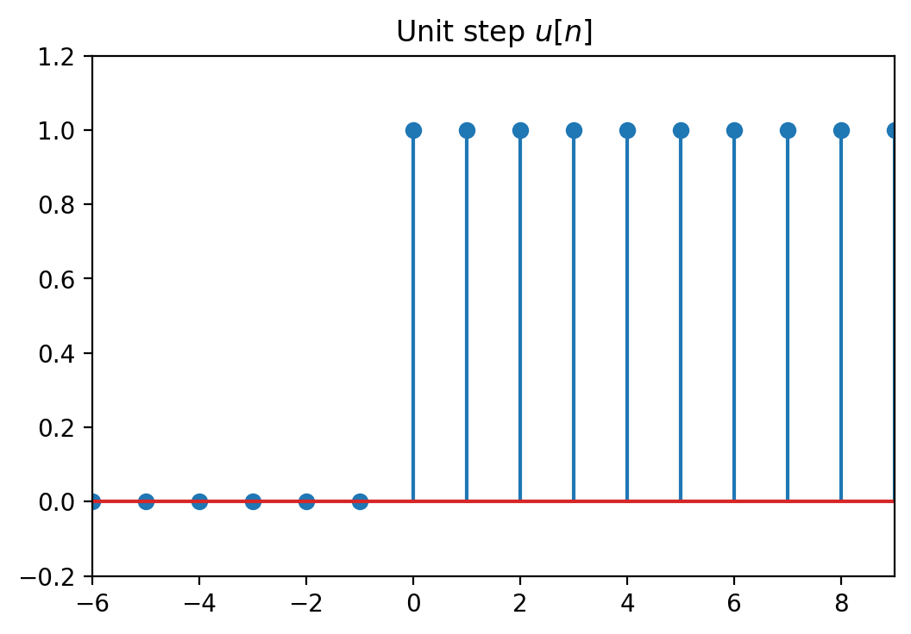{width=10cm}\

### Unit ramp

#### Unit ramp

It is denoted with $u_r[n]$.

$$u_r[n] = 
\begin{cases}
n &\mbox{if } n \geq 0 \\
0 & \mbox{otherwise}
\end{cases}.$$

### Representation

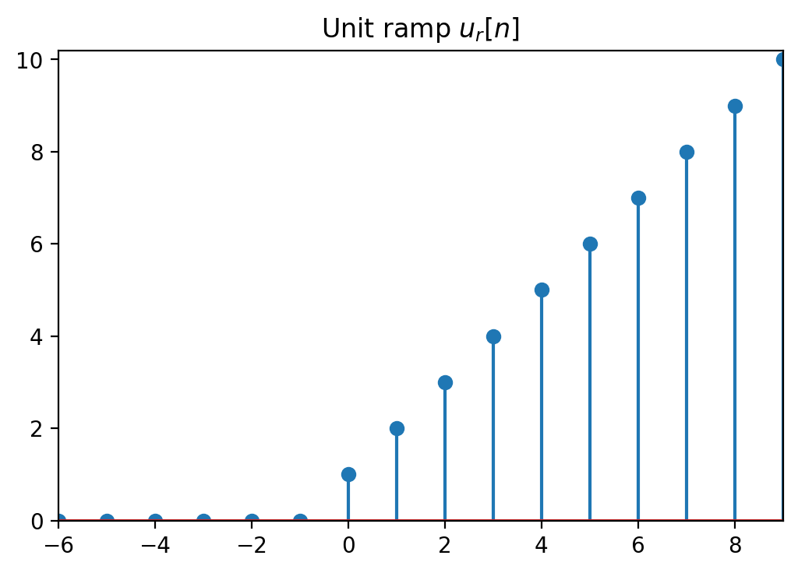{width=10cm}\

### Exponential signal

#### Exponential signal

It does not have a special notation. It is defined by:
$$x[n] = a^n.$$

$a$ can be a real or a complex number. Here we consider only the case when $a$ is real. 

Depending on the value of $a$, we have four possible cases:

1. $a \geq 1$
2. $0 \leq a < 1$
3. $-1 < a < 0$
4. $a \leq 1$

### Representation

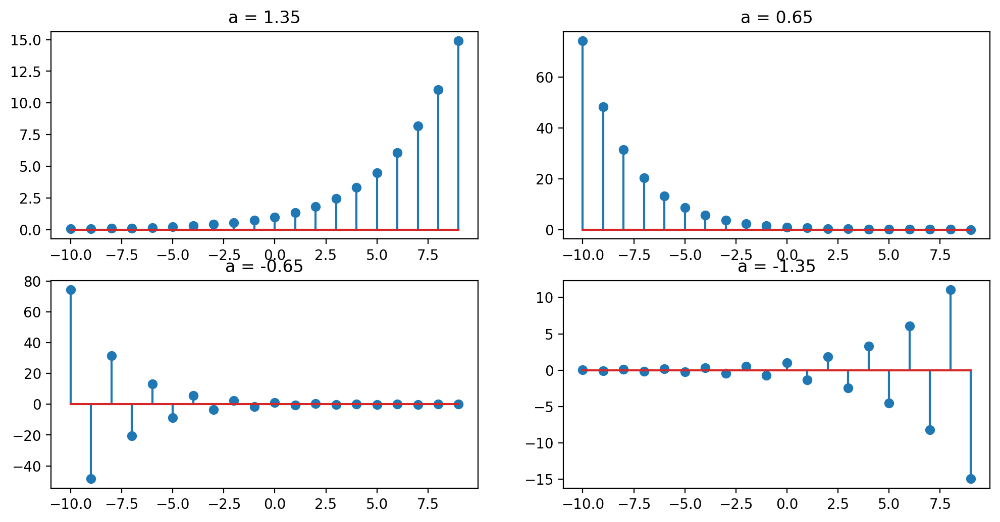{width=10cm}\

## II.2 Types of discrete signals

### Signals with finite energy

- The **energy of a discrete signal** is defined as
$$E = \sum_{n=-\infty}^{\infty} (x[n])^2.$$

- If $E$ is finite, the signal is said to have finite energy.

- Examples: 
    - unit impulse has finite energy
    - unit step does not

### Connection with DEDP class

- Cross-link with DEDP course:
$$E = \|\mathbf{x} - \mathbf{0}\|^2 = \|\mathbf{x}\|^2$$

- Energy of a signal = **squared Euclidean distance to 0**
    - geometric interpretation: squared length of the segment
from 0 to the point $\mathbf{x}$
    - holds for continuous signals as well:
$$E = \|\mathbf{x}\|^2 = \int_{-\infty}^\infty x^2(t) dt$$

### Signals with finite power

- The **average power of a discrete signal** is defined as
$$P = \lim_{N \to \infty} \frac{\sum_{n=-N}^{N} (x[n])^2}{2N+1}.$$

- In other words, the average power is the average energy per sample.

- If $P$ is finite, the signal is said to have finite power.

- A signal with finite energy has finite power ($P=0$ if the signal has infinite length). A signal with infinite energy can have finite or infinite power.

- Example: unit step has finite power $P = \frac{1}{2}$ (proof at blackboard).

### Connection with DEDP class

- Average power = temporal average squared value $\overline{X^2}$
    - i.e. average value of the square of samples

### Periodic and non-periodic signals

- A signal is called **periodic** if its values repeat themselves after a certain time (known as **period**).
$$x[n] = x[n + N]), \forall t$$

- The **fundamental period** of a signal is the minimum value of $N$.

- Periodic signals have infinite energy, and finite power equal to the power of a single period.

### Even and odd signals

- A real signal is **even** if it satisfies the following symmetry:
$$x[n] = x[-n], \forall n.$$

- A real signal is **odd** if it satisfies the following anti-symmetry:
$$-x[n] = x[-n], \forall n.$$

- There exist signals which are neither even nor odd.

### Even and odd signals: example

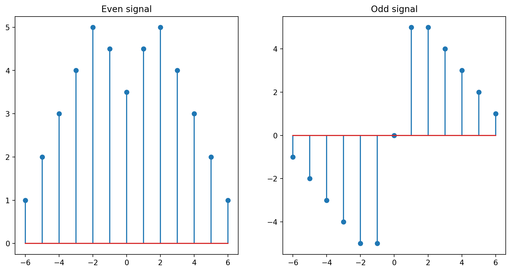{width=12cm}\

### Even and odd parts of a signal

- Every signal can be written as the sum of an even signal and an odd signal:
$$x[n] = x_e[n] + x_o[n]$$

- The even and the odd parts of the signal can be found as follows:

$$x_e[n] = \frac{x[n] + x[-n]}{2}.$$

$$x_o[n] = \frac{x[n] - x[-n]}{2}.$$

- Proof: check that $x_e[n]$  is even, $x_o[n]$ is odd, and their sum is $x[n]$

### Even and odd parts: example

{width=12cm}\

## II.3 Basic operations with discrete signals

### Time shifting

- The signal $x[n-k]$ is $x[n]$ **delayed with $k$ time units**
    - Graphically, $x[n-k]$ is shifted $k$ units to the **right** compared to the original

- The signal $x[n+k]$ is $x[n]$ **anticipated with $k$ time units**
    - Graphically, $x[n+k]$ is shifted $k$ units to the **left** compared to the original signal.

### Time shifting: representation

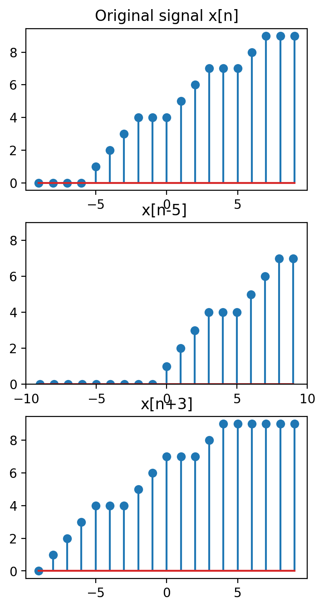\

### Time reversal

- Changing the variable $n$ to $-n$ produces a signal $x[-n]$ which mirrors $x[n]$.

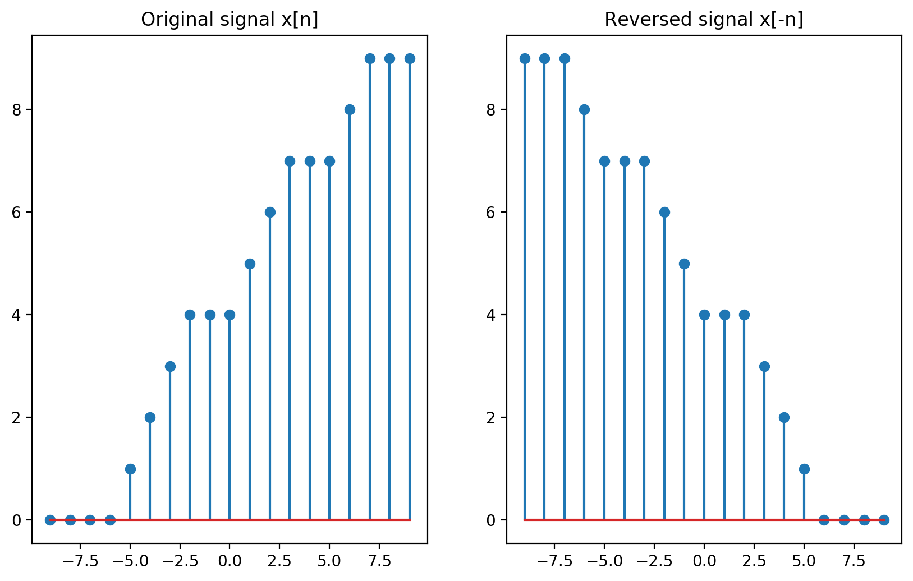\

### Subsampling
- **Subsampling** by a factor of M = 
keep only 1 sample from every M of the original signal
    - Total number of samples is reduced M times
$$x_{M\downarrow}[n] = x[Mn]$$

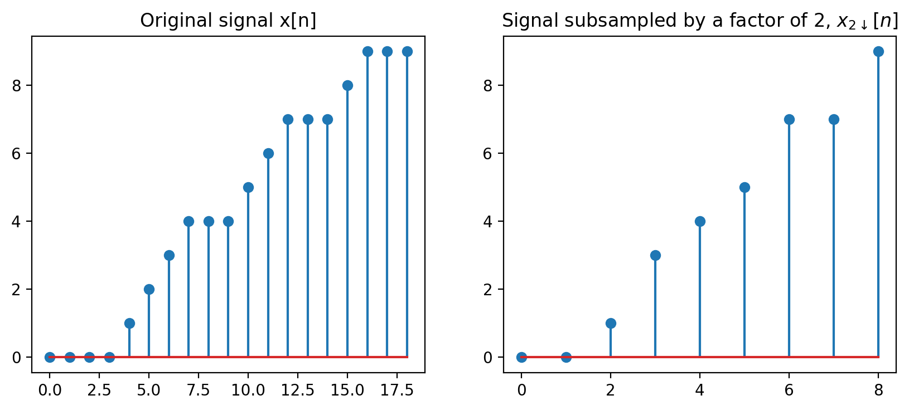\

### Interpolation

- **Interpolation** by a factor of $L$ adds $(L-1)$ 
zeros between two samples in the original signal
    - Total number of samples increases L times
$$
x_{L\uparrow} = 
\begin{cases}
x[\frac{n}{L}] &\mbox{if } \frac{n}{L} \in \mathbb{N} \\
0 & \mbox{otherwise}
\end{cases}.
$$

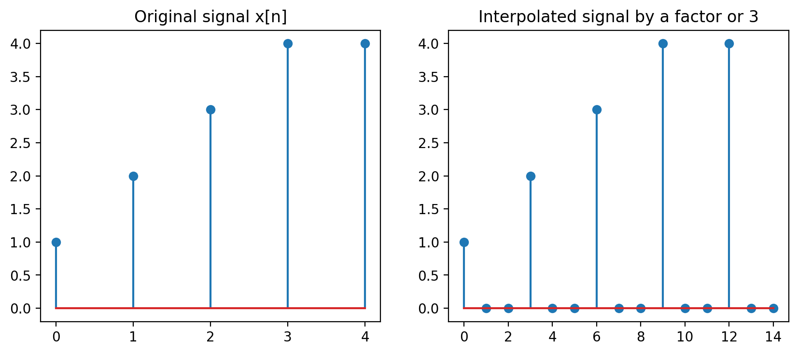{width=12cm}\

### Mathematical operations

- A signal $x[n]$ can be **scaled** by a constant A, i.e. each sample is multipled by A:

$$y[n] = A x[n].$$

- Two signals $x_1[n]$ and $x_2[n]$ can be **summed** by summing the individual samples:

$$y[n] = x_1[n] + x_2[n]$$

- Two signals $x_1[n]$ and $x_2[n]$ can be **multiplied** by multiypling the individual samples:

$$y[n] = x_1[n] \cdot x_2[n]$$

## II.4 Discrete systems

### Definition

- **System** = a device or algorithm which produces an **output signal** based on an **input signal**

- We will only consider systems with a single input and a single output

- Figure here: blackboard.

- Common notation:
    - x[n] is the input
    - y[n] is the output
    - H is the system. 

### Notations

- Notations:
$$y[n] = H\left[x[n]\right]$$
("*the system H applied to the input x[n] produces the output y[n]*")

$$x[n] \overset{H}{\rightarrow} y[n]$$
("*the input $x[n]$ is transformed by the system H into y[n]*")

### Equations

- Usually, a system is described by the **input-output equation** (or **difference equation**) which expains how $y[n]$ is defined in terms of $x[n]$.

Examples:

1. $y[n] = x[n]$  (the identity system)
2. $y[n] = x[n-3]$
3. $y[n] = x[n+1]$
4. $y[n] = \frac{1}{3}(x[n+1] + x[n] + x[n-1])$
5. $y[n] = \max(x[n+1], x[n], x[n-1])$
6. $y[n] = (x[n])^2 + \log_{10} x[n-1]$
7. $y[n] = \sum_{k=-\infty}^{n} x[k] = x[n] + x[n-1] + x[n-2] + ...$

### Example

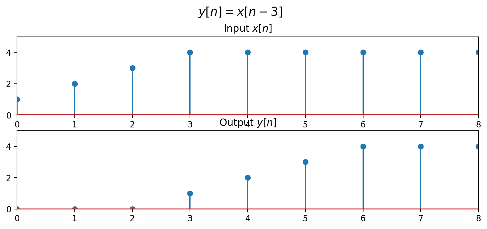\

### Example

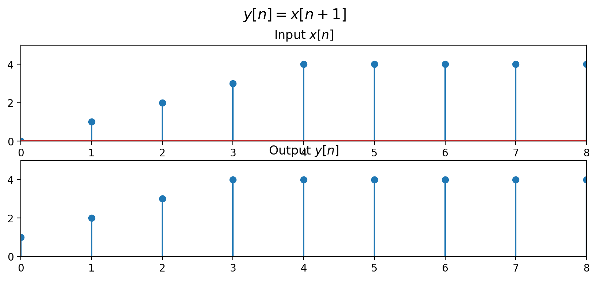\

### Example

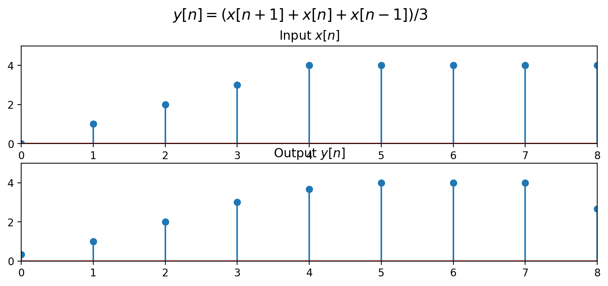\

### Example

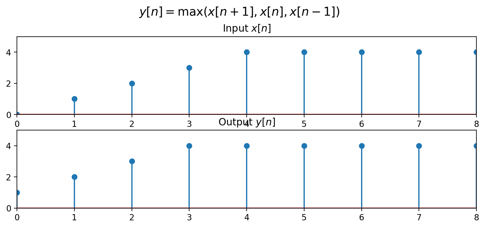\

### Example 

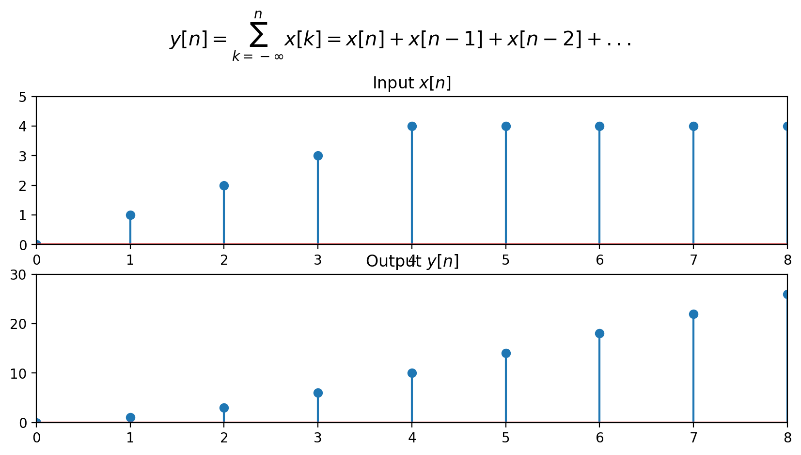\

### Recursive systems

- Some systems can/must be written in **recursive form**
$$y[n] = y[n-1] + x[n],$$

- Must always specify **initial conditions**
    - i.e. initial value (e.g. $y[-1] = 2.5$)
    - if not mentioned, assume they are 0 ("relaxed system")
    - they represent the internal state of the system at the
starting moment

- For recursive systems, the output signal depends on 
both the input signal **and** on the initial conditions
    - different initial conditions lead to different outputs, 
even if input signal is the same 
    - a recursive system with non-zero initial conditions can produce an output signal even in the absence of an input ($x[n] = 0$)

### Representation of systems

- The operation of a system can be described graphically (see examples on blackboard):

    - summation of two signals
    - scaling of a signal with a constant
    - multiplication of two signals
    - delay element
    - anticipation element
    - other blocks for more complicated math operations

## II.4 Classification of discrete systems

### Memoryless / systems with memory

- **Memoryless (or static)**:  output at time $n$ depends only on the input **from the same moment** $n$

- Otherwise, the system **has memory (dynamic)**

- Examples:

    - memoryless: $y[n] = (x[n])^3 + 5$
    - with memory: $y[n] = (x[n])^3 + x[n-1]$

### Memoryless / systems with memory

- Memory of size $N$:
    - output at time $n$ $y[n]$ depends only up to the last $N$ inputs, $x[n-N], x[n-(N-1)],... x[n]$,
    - if $N$ is finite: the system has **finite memory**
    - if $N = \infty$, the system has **infinite memory**

- Examples:
    - finite memory of order 4: $y[n] = x[n] + x[n-2] + x[n-4]$ 
    - infinite memory: $y[n] = 0.5y[n-1] + 0.8 x[n]$
        - recursive systems usually have infinite memory

### Memoryless / systems with memory

- An input sample has an effect on the output only for the next $N$ time moments

- For systems infinite memory, any sample influences **all** the following samples, forever
    - but, if system is stable, the influence gets smaller and smaller

### Time-Invariant and Time-Variant systems

- A relaxed system $H$ is **time-invariant** if and only if:
$$x[n] \overset{H}{\rightarrow} y[n]$$
implies, $\forall x[n], \forall k$, that
$$x[n-k] \overset{H}{\rightarrow} y[n-k]$$ 

- Delaying the input signal with $k$ will only delay the output with the same amount, otherwise the output is not affected
    - Must be true for all input signals, for all possible delays (positive or negative)

- Otherwise, the system is said to be **time-variant**

### Time-Invariant and Time-Variant systems

- Examples:
    - $y[n] = x[n] - x[n-1]$ is time-invariant
    - $y[n] = n \cdot x[n]$ is not time-invariant

- A system is time-invariant if it depends on $n$ only through the input signal $x[n]$

### Example 

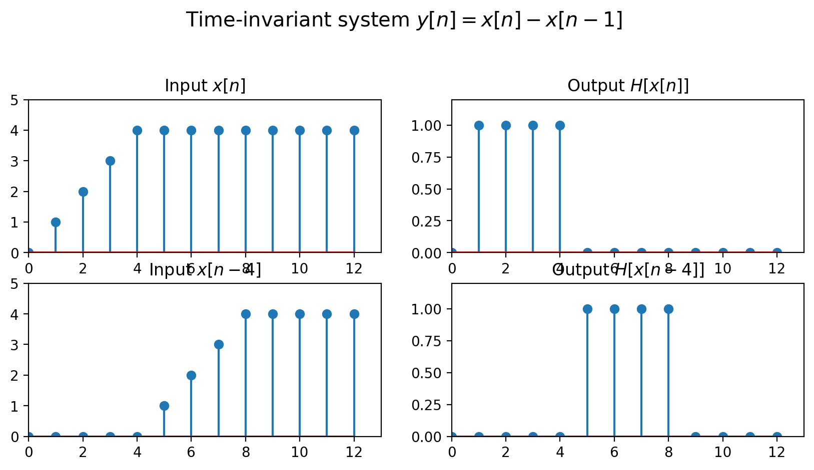\

### Another example 

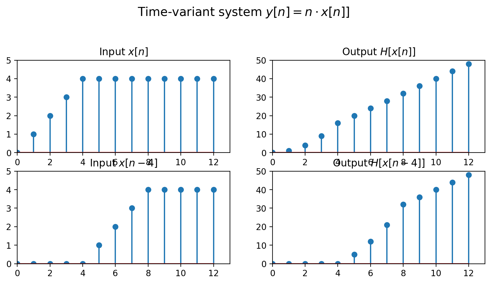\

### Linear and nonlinear systems

- A system $H$ is **linear** if:

$$H\left[ a x_1[n] + b x_2[n]\right] = a H\left[ x_1[n] \right] + b H\left[ x_2[n] \right].$$

- Composed of two parts:
    - Applying the system to a sum of two signals = applying the system to each signal, and adding the results
    - Scaling the input signal with a constant $a$ is the same as scaling the output signal with $a$

- The same relation will be true for a sum of many signals, not just two

### Linear and nonlinear systems

- Advantage of linear systems
    - Complicated input signals can be decomposed into a sum of smaller parts
    - The system can be applied to each part independently
    - Then the results are added back

- Examples:
    - linear system: $y[n] = 3 x[n] + 5x[n-2]$
    - nonlinear system: $y[n] = 3 (x[n])^2 + 5x[n-2]$

### Linear and nonlinear systems

- For a system to be linear, the input samples $x[n]$ must not undergo non-linear transformations. 

- **The only transformations** of the input x[n] allowed to take place in a linear system are:

    - scaling (multiplication) with a constant
    - delaying
    - summing different delayed versions of the signal (not summing with a constant)

### Causal and non-causal systems

- **Causal**: the output $y[n]$ depends only on the current input $x[n]$ and the past values $x[n-1]$, $x[n-2]$..., but not on the future samples $x[n+1]$, $x[n+2]$...

- Otherwise the system is **non-causal**.

- A causal system can operate in real-time
    - we need only the input samples from the past
    - non-causal systems need samples from the future

- Examples:
    - $y[n] = x[n] - x[n-1]$ is causal
    - $y[n] = x[n+1] - x[n-1]$ is non-causal
    - $y[n] = x[-n]$ is non-causal

### Stable and unstable systems

- **Bounded** signal: if there exists a value $M$ such that all the samples of the signal or smaller than M, in absolute values

$$x[n] \in [-M, M]$$

$$\lvert x[n] \rvert \leq M$$

- **Stable** system: if for any bounded input signal it produces a bounded output signal
    - not necessarily with the same $M$
    - known as BIBO (Bounded Input --> Bounded Output)

- In other words: when the input signal has bounded values, the output signal does not go towards $\infty$ or $-\infty$.

### Stable and unstable systems

- Examples:
    - $y[n] = (x[n])^3 - x[n+4]$ is stable
    - $y[n] = \frac{1}{x[n] - x[n-1]}$ is unstable
    - $y[n] = \sum_{k=-\infty}^{n} x[k] = x[n] + x[n-1] + x[n-2] + ...$ is unstable

## Impulse response of Linear Time-Invariant (LTI) systems

### Linear Time-Invariant (LTI) systems

- Notation: An **LTI** system (**L**inear **T**ime-**I**nvariant) is a system which is simultaneously **linear** and **time-invariant**. 

- LTI systems can be described via either (or both):

    1. the **impulse response** $h[n]$
    2. the **difference equation** 
$$\begin{split}
y[n] =& -\sum_{k=1}^N a_k y[n-k] + -\sum_{k=1}^M b_k x[n-k] \\
=& -a_1 y[n-1] - a_2 y[n-2] -... - a_N y[n-N] + b_0 x[n] + b_1 x[n-1] + ... + b_M x[n-M]
\end{split}$$

### The impulse response

- **Impulse response** of a system = output (response) of when the input signal is the impulse $\delta[n]$:

$$h[n] = H(\delta[n])$$

- The impulse response of a LTI system **fully characterizes the system**:
    - based on $h[n]$ we can compute the response of the system to **any** input signal
    - all the properties of LTI systems can be described via characteristics of the impulse response

### Signals are a sum of impulses

- Any signal can be composed as **a sum of scaled and delayed impulses $\delta[n]$**.

- Example: $x[n] = \{3, 1, -5, 0, 2\} = 3\delta[n] + \delta[n-1] -5 \delta[n-2] + 2\delta[n-2]$

- In general
$$x[n] = \sum_{k=-\infty}^\infty x[k]\delta[n-k]$$

i.e. a sum of impulses $\delta[n]$, delayed with $k$ and scaled with the corresponding value $x[k]$

### Convolution

- The response of a LTI system to a sum of impulses, delayed with $k$ and scaled with $x[k]$, **is a sum of impulse responses, delayed with $k$ and scaled with $x[k]$**.
    - The input signal is composed of separate impulses
    - LTI system --> each impulse will generate its own response
    - output signal is the sum of impulse responses, delayed and scaled
$$\begin{split}
y[n] =& H \left( x[n] \right) \\
=& H \left( \sum_{k=-\infty}^\infty x[k]\delta[n-k] \right) \\
=& \sum_{k=-\infty}^\infty x[k] H \left( \delta[n-k] \right) \\
=& \sum_{k=-\infty}^\infty x[k] h[n-k]. \\
\end{split}$$

### Convolution 

- This operation = the **convolution** of two signals $x[n]$ and $h[n]$
$$x[n] * h[n] = \sum_{k=-\infty}^\infty x[k] h[n-k]$$

- The response of a LTI system to an input signal x[n] is **the convolution of x[n] with the system's impulse response h[n]**

### Example

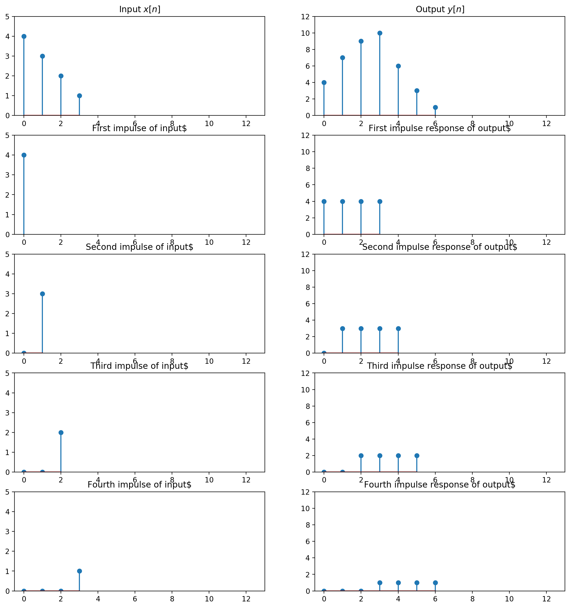\

### Interpretation of the convolution equation

The convolution equation can be interpreted in two ways:

1. The output signal $y[n]$ = a sum of a lot of impulse responses $h[n]$,
each one delayed by $k$ (hence $[n-k]$) and scaled by $x[k]$
    - one for each sample in the input signal
    - explain at blackboard

$$x[n] * h[n] = \sum_{k=-\infty}^\infty x[k] \mathbf{h[n}-k\mathbf{]}$$

### Interpretation of the convolution equation

2. Each output sample $y[n]$ = a **weighted sum** of the input samples around it
    - $y[n] = ... + h[2] \cdot x[n-2] + h[1]\cdot x[n-1] + h[0]\cdot x[n] + h[n+1] \cdot x[n+1] + ...$

- If $h[n]$ has finite length (e.g. non-zero only between $h[-2] ... h[2]$),
then there are only a few terms in the sum
    - Example at blackboard

$$x[n] * h[n] = \sum_{k=-\infty}^\infty h[k] \mathbf{x[n}-k\mathbf{]}$$

### Interpretation of the convolution equation

{.id height=60%}

* image from http://www.stokastik.in

### Interpretation of the convolution equation

* Watch the following:

https://www.youtube.com/watch?v=ulKbLD6BRJA

### 2D convolution

* Convolution can be applied in 2D (for images)

* The input signal = an image I[x, y]

* The impulse response (the ***kernel***) = a matrix H[x, y]

* The convolution result:

$$Y[x,y] = I * H = \sum_{i=-\infty}^\infty \sum_{j=-\infty}^\infty I[x-i,y-j] \cdot H[i,j]$$

### 2D convolution

* image from http://machinelearninguru.com

### 2D Convolution

* Watch this:

http://machinelearninguru.com/computer_vision/basics/convolution
/convolution_layer.html

### 2D Convolution

* Simple image effects with 2D convolutions:
    * the "kernel" = the impulse response $H[x,y]$

see https://en.wikipedia.org/wiki/Kernel_(image_processing)

* What are their 1D counterparts?

### Properties of convolution

* Convolution is commutative (the order of the two signals doesn't matter): 

$$x[n] * h[n] = \sum_{k=-\infty}^\infty x[k] h[n-k] = h[n] * x[n] = \sum_{k=-\infty}^\infty h[k] x[n-k]$$.
Proof: make variable change $(n-k) \rightarrow l$, change all in equation

* Convolution is associative

$$(a[n] * b[n]) * c[n] = a[n] * (b[n] * c[n])$$.
(No proof)

### Properties of convolution

* The unit impulse is neutral element for convolution

$$a[n] * \delta[n] = \delta[n] * a[n]  = a[n]$$.
Proof: equation

* Convolution is a linear operation
$$(\alpha \cdot a[n] + \beta \cdot b[n]) * c[n] = \alpha (\cdot a[n] * c[n]) + \beta \cdot (b[n] * c[n])$$
Proof: by linearity of the corresponding system

### Properties of LTI systems expressed with $h[n]$

#### 1. Identity system

- A system with $h[n] = \delta[n]$ produces an response equal to the input, $y[n] = x[n], \forall x[n]$.

- Proof: $\delta[n]$ is neutral element for convolution.

### Properties of LTI systems expressed with $h[n]$

#### 2. Series connection is commutative

- LTI systems connected in series can be interchanged in any order

- Proof: by commutativity of convolution.

- LTI systems connected in series are equivalent to a single system with

$$h_{equiv}[n] = h_1[n] * h_2[n] * ... * h_N[n]$$

### Properties of LTI systems expressed with $h[n]$

#### 3. Parallel connection means sum

LTI systems connected in parallel are equivalent to a single system with

$$h_{equiv}[n] = h_1[n] + h_2[n] + ... + h_N[n]$$

### Properties of LTI systems expressed with $h[n]$

#### 4. Response of LTI systems to unit step

- If the input signal is $u[n]$, the response of the system is
$$s[n] = u[n] * h[n] = h[n] * u[n] = \sum_{k=-\infty}^\infty h[k] u[n-k] = \sum_{k=-\infty}^n h[k]$$.

### Properties of LTI systems expressed with $h[n]$

- Proof:

    - The signal $\sum_{k=-\infty}^n h[k]$ is a *discrete-time integration* of $h[n]$
    - The unit step $u[n]$ iteslf is the discrete-time integral of the unit impulse:
$$u[n] = \sum_{k=-\infty}^n \delta[k]$$
$$\delta[n] = u[n] - u[n-1]$$
    - Therefore the system response to the integral of the impulse = the integral of the system response to the impulse

    - The interchanging of the integration with the system is due to the linearity of the system and is valid for all signals:

$$H \left( \sum_{k=-\infty}^n x[k] \right) = \sum_{k=-\infty}^n H \left( x[k] \right) $$

## Relation between LTI system properties and $h[n]$

### 1. Causal LTI systems and their $h[n]$

If a LTI system is causal, then 
$$h[n] = 0, \forall n < 0$$

- Proof: 

    - $y[n] = \sum_{k=-\infty}^{\infty} x[k] h[n-k]$, 
    - $y[n]$ does not depend on $x[n+1], x[n+2], ...$
    - it means that these terms are multiplied with 0
    - the value $x[n+1]$ is multiplied with $h[n-(n+1)] = h[-1]$, $x[n+2]$ is multiplied with $h[n-(n+2)] = h[-2]$, and so on
    - Therefore:
$$h[n] = 0, \forall n < 0$$.

### Causal signals and causal systems

- A signal which is 0 for $n<0$ is called a *causal **signal***

- Otherwise the signal is *non-causal*

- We can say that *a system is causal if and only if it has a causal impulse response*

- Further definitions:

    - a signal which 0 for $n>0$ is called an *anti-causal* signal
    - a signal which has non-zero values both for some $n>0$ and for some $n<0$ (and thus is neither causal nor non-causal) is called *bilateral*. 

### Example

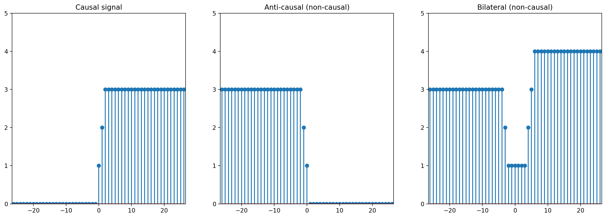\

### 2. Stable systems and their $h[n]$

- Considering a bounded input signal, $\lvert x[n] \rvert \leq A$, the absolute value of the output is:
$$\begin{split}
\lvert y[n] \rvert  =& \lvert \sum_{k=-\infty}^\infty x[k] h[n-k] \rvert \\
\leq & \sum_{k=-\infty}^\infty \lvert x[k] h[n-k] \rvert  \\
= & \sum_{k=-\infty}^\infty \lvert x[k] \rvert \lvert h[n-k] \rvert \\
\leq & A \sum_{k=-\infty}^\infty \lvert h[n-k] \rvert 
\end{split}$$

- Therefore **a LTI system is stable if $$\sum_{k=-\infty}^\infty \lvert h[n] \rvert < \infty$$**.

### 3. Memoryless systems and their $h[n]$ (Exercise)

**Exercises:**

- What can we say about the impulse response $h[n]$ of a memoryless system? 

- What about a system with finite memory $M$?

## FIR and IIR systems

### Support

- The **support** of a discrete signal = the smallest interval of $n$ such that the signal is 0 everywhere outside the interval.

- Examples: at whiteboard

- Depending on the support of the impulse response, discrete LTI systems can be **FIR** or **IIR** systems.

### FIR systems

- A **F**inite **I**mpulse **R**esponse (**FIR**) system has an impulse response with finite support
    - i.e. the impulse response is 0 outside a certain interval.

- For a causal system:
    - $h[n] = 0$ for $n < 0$
    - therefore $h[n] = 0$ for $n < 0$ or $n \geq M$, for some $M$
    - The convolution becomes:
$$y[n] = \sum_{k=0}^M h[k] x[n-k] = h[0] \cdot x[n] + h[1] \cdot x[n-1] + ... h[M] \cdot x[n-M]$$

- For a causal FIR system, the output is a linear combination of the last $M$ input samples (has finite memory $M$)

### IIR systems

- An **I**nfinite **I**mpulse **R**esponse (**FIR**) system has an impulse response with infinite support
    - i.e. the impulse response never becomes completely 0 forever.

- Causal system: the output $y[n]$ potentially depends on all the preceding input samples
    - from the convolution equation

- An IIR system has infinite memory

### Recursive / non-recursive implementations

- **Recursive** implementation: compute $y[n]$ based partly on the previous output samples $y[n-1], y[n-2],...$.
    - more efficient

- For a recursive LTI system, the output $y[n]$ depends on:
    - the last $N$ samples of the output, y[n-1], ... y[n-N]
    - and the current and the last $M$ samples of the input, x[0], x[1], ... x[n-M].

- Example:

$$y[n] = \frac{1}{n+1}\sum_0^n x[n]$$

can be rewritten in recursive form:

$$y[n] = n\cdot y[n-1] + x[n]$$

### Recursive / non-recursive implementations

- **Non-recursive** system: the output $y[n]$ is computed based only on last $M$ samples of the input, x[0], x[1], ... x[n-M].

- FIR systems can always be implemented non-recursively, but may also be implemented in a recursive way

- IIR systems can only be implemented recursively
    - otherwise they would need infinite memory
    

### Initial conditions for recursive systems

- Recursive systems rely on previous outputs --> the previous values must be always available

- We need some starting values at the start moment (**the initial conditions** of the system)

- Notes:

    - Output signal depends on the input **and** on the initial conditions
    - A system with non-zero initial conditions produces an output even when the input signal is zero
    - This output is called *zero-input response*, $y_{zi}[n]$
    - A system with initial conditions equal to 0 is called *relaxed*
    - The output of a relaxed system to an input signal is called *zero-state response*, $y_{zs}[n]$ (also called *forced response*)
    
- For linear systems, the output of a system is always the sum of the forced response and the natural response:
$$y[n] = y_{zs}[n] + y_{zi}[n]$$

